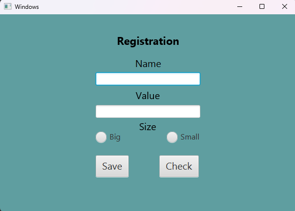

# 2023-3_Java_JavaFX_login-and-file-manipulation

## Overview
This project is a Java application that uses JavaFX to create a graphical user interface. This was an introduction to JavaFX. It features a basic password input field, that when inputting a correct password switches to registration scene, which lets you enter multiple fields. When filling these fields and saving, the data inside these fields is saved into a data/info.txt file and is ready to be accessed in the next run. By clicking "Check" these values will be displayed.

## Features
- GUI built with JavaFX and Scene Builder (FXML-based).
- Comprehensive and organized file structure.
- Login functionality.
- Ability to save multiple input types data into a seperate file.
- Uses Java class setters and getters to handle and manipulate field values.

## How to Run
1. Make sure you have Java JDK 11 or newer installed, along with the JavaFX SDK.
2. Open the project folder in **Visual Studio Code** or any other alternative that supports compiling and running Java code.
3. When running the program, add the following VM options to include JavaFX libraries: --module-path **path to jdk lib** --add-modules javafx.controls,javafx.fxml.
4. You can add these VM options in your launch configuration (`launch.json`) or via your IDE’s run/debug settings.
5. If ur using **Visual Studio Code** you have to navigate the *JAVA PROJECTS* bottom left corner. Select Referenced Libraries and click the *+* icon, then add all .jar files inside **javafx-sdk-"version"/lib**.
6. Open `src\Main.java`.
7. Click **Run** to start the application.
