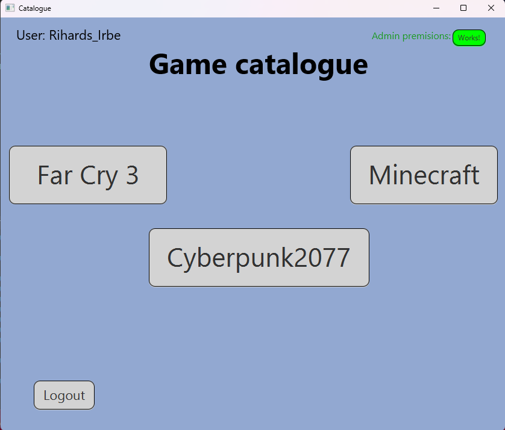
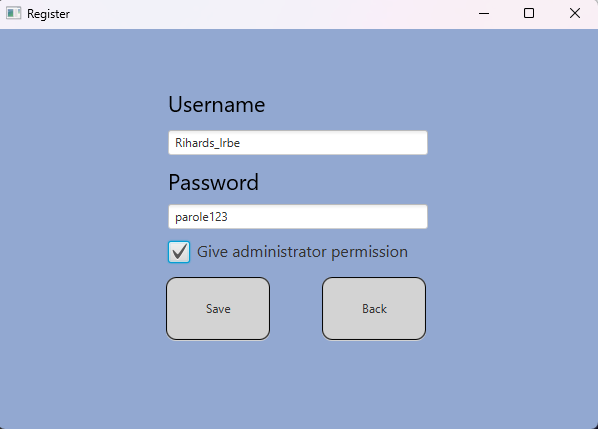
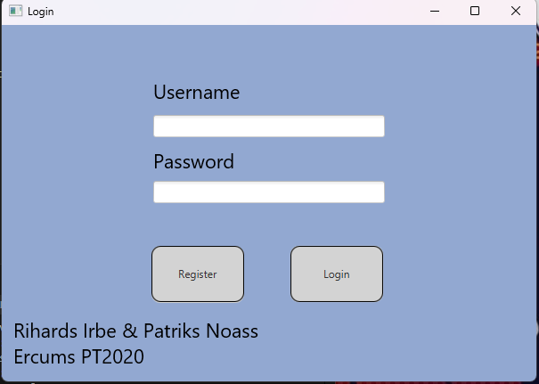
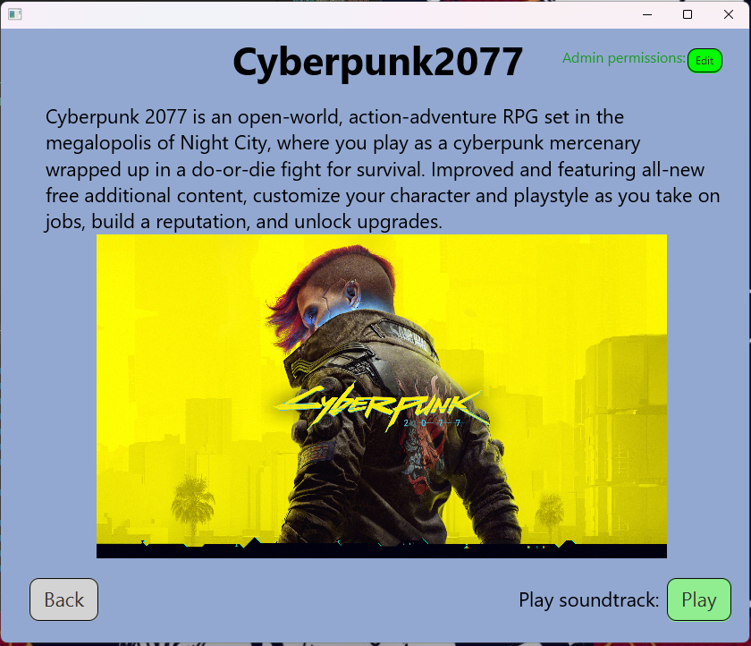
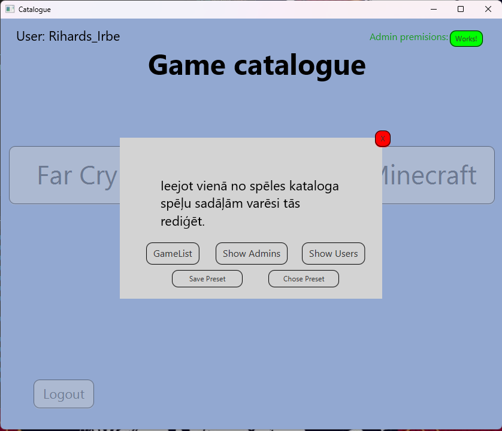
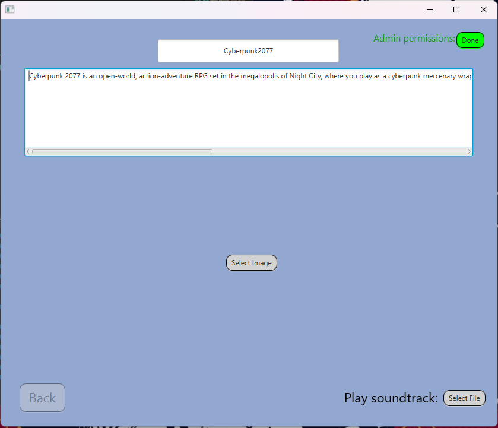

# 2023-5_Java_JavaFX_game-catalouge

## Overview
This project is a Java application that uses JavaFX to create a graphical user interface. It features a catalog of three games, each accessible via dedicated buttons. When a user clicks on a game button, a description and an image of the game are displayed, along with an option to play its soundtrack. Users can navigate back or interact with each game entry through the interface.
Additionally, the project includes a login/register system with admin level permissions. Admin users have the ability to modify game descriptions, images, and each games audio/soundtrack files directly within the application. They can also view a list of all registered users and manage game presets by saving or loading image, description, and audio configurations.

## Features
- GUI built with JavaFX and Scene Builder (FXML-based).
- Comprehensive and organized file structure.
- Rich multimedia experience including images and audio.
- Login/Register functionality with admin role support.
- User data gets saved into an array, thus letting the user create multiple accounts and validate if username is already taken.
- Admins can:
  * Edit game content (description, image, audio).
  * View and manage all registered users.
  * Save or load content presets to/from external files.

## How to Run
1. Make sure you have Java JDK 11 or newer installed, along with the JavaFX SDK.
2. Open the project folder in **Visual Studio Code** or any other alternative that supports compiling and running Java code.
3. When running the program, add the following VM options to include JavaFX libraries: --module-path **path to jdk lib** --add-modules javafx.controls,javafx.fxml.
4. You can add these VM options in your launch configuration (`launch.json`) or via your IDE’s run/debug settings.
5. If ur using **Visual Studio Code** you have to navigate the *JAVA PROJECTS* bottom left corner. Select Referenced Libraries and click the *+* icon, then add all .jar files inside **javafx-sdk-"version"/lib**.
6. Open `src\sample\Main.java`.
7. Click **Run** to start the application.
