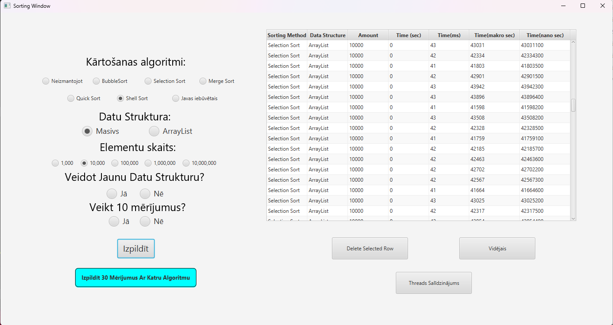
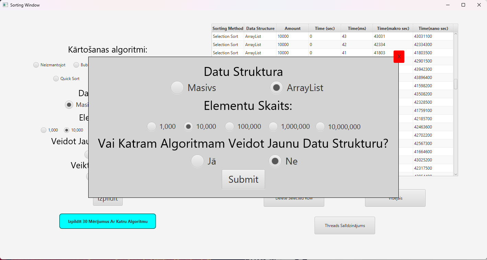
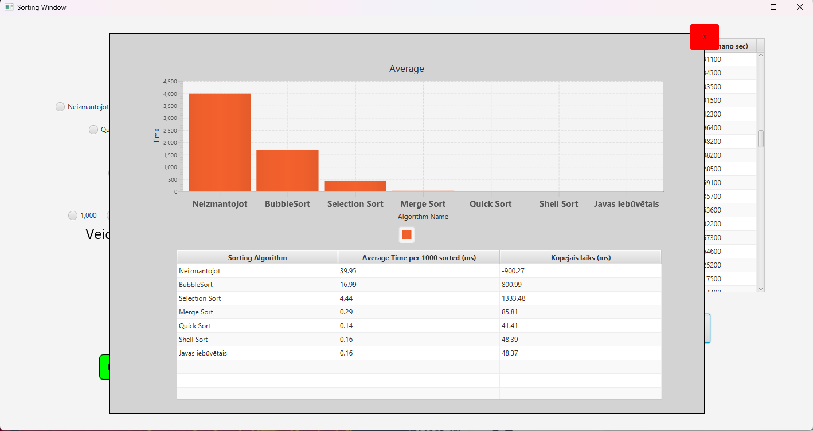
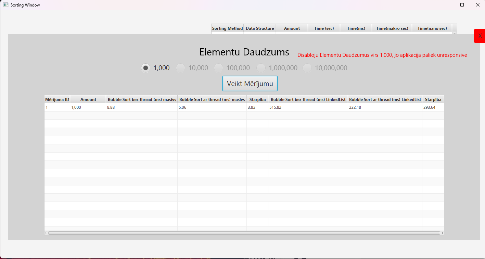

# 2023-9_Java_JavaFX_sorting-algorithm-measuring

## Overview
This project is a Java application that uses JavaFX to create a graphical user interface. This project is used to measure sorting algorithms: 
1. Sorting algorithm, that I made, 
2. Bubble Sort,
3. Selection Sort, 
4. Merge Sort, 
5. Quick Sort, 
6. Shell Sort
7. Java built in sorting method.
Users can choose between two data structures: Array and ArrayList, and define the number of random elements to generate (from 1,000 up to 10,000,000 — values above 10,000 are not recommended for slower systems).

The results of each sort are displayed in a table, where users can remove rows or analyze the data further. An Average button generates a graph and summary table showing the comparative performance of all algorithms. Additionally, users can run a sorting operation in a separate thread, which is useful for performance comparison and UI responsiveness.

## Features
- GUI built with JavaFX and Scene Builder (FXML-based).
- Comprehensive and organized file structure.
- Contains tables for better data readability.
- Ability to delete data from table, to remove faulty data.
- Multiple sorting algorithms implemented for comparison
- Supports both Array and ArrayList data structures
- Configurable element count (1,000–10,000,000)
- Bulk measurement tool: Run 30 measurements per algorithm with one click
- Visually displays sorting speeds using a graph.
- Lets the user to run sorting algorithms on a seperate thread for better comparison.

## How to Run
1. Make sure you have Java JDK 11 or newer installed, along with the JavaFX SDK.
2. Open the project folder in **Visual Studio Code** or any other alternative that supports compiling and running Java code.
3. When running the program, add the following VM options to include JavaFX libraries: --module-path **path to jdk lib** --add-modules javafx.controls,javafx.fxml.
4. You can add these VM options in your launch configuration (`launch.json`) or via your IDE’s run/debug settings.
5. If ur using **Visual Studio Code** you have to navigate the *JAVA PROJECTS* bottom left corner. Select Referenced Libraries and click the *+* icon, then add all .jar files inside **javafx-sdk-"version"/lib**.
6. Open `src\sample\Main.java`.
7. Click **Run** to start the application.
