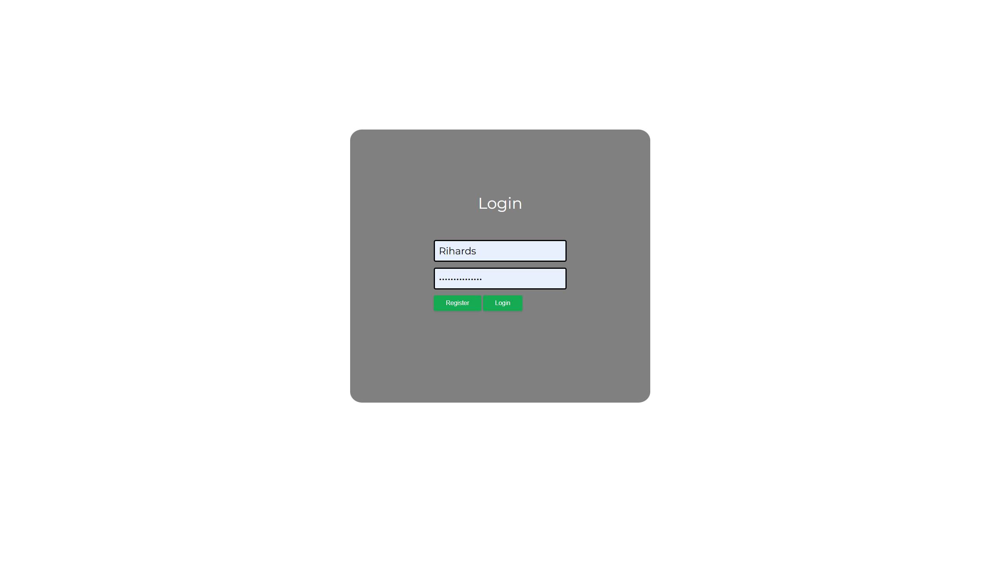
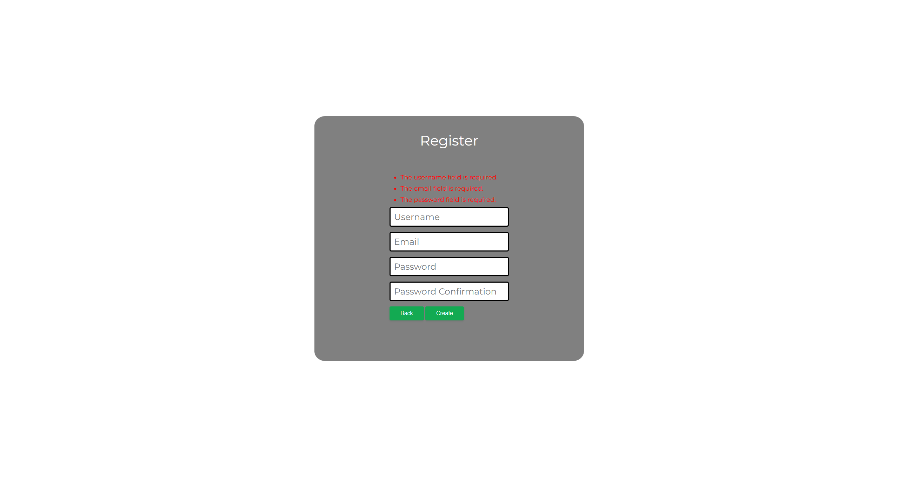
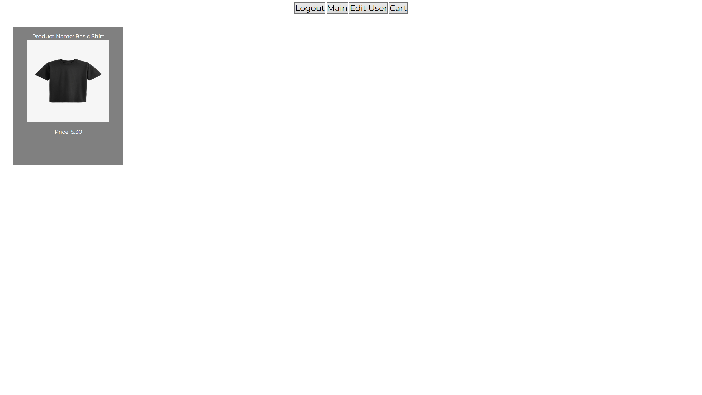
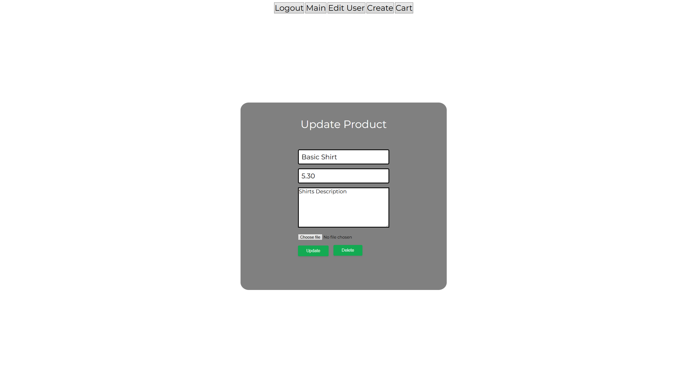
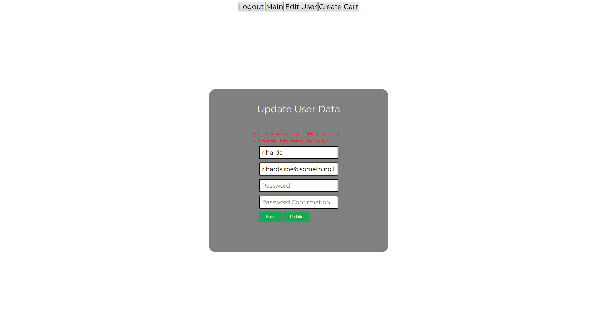
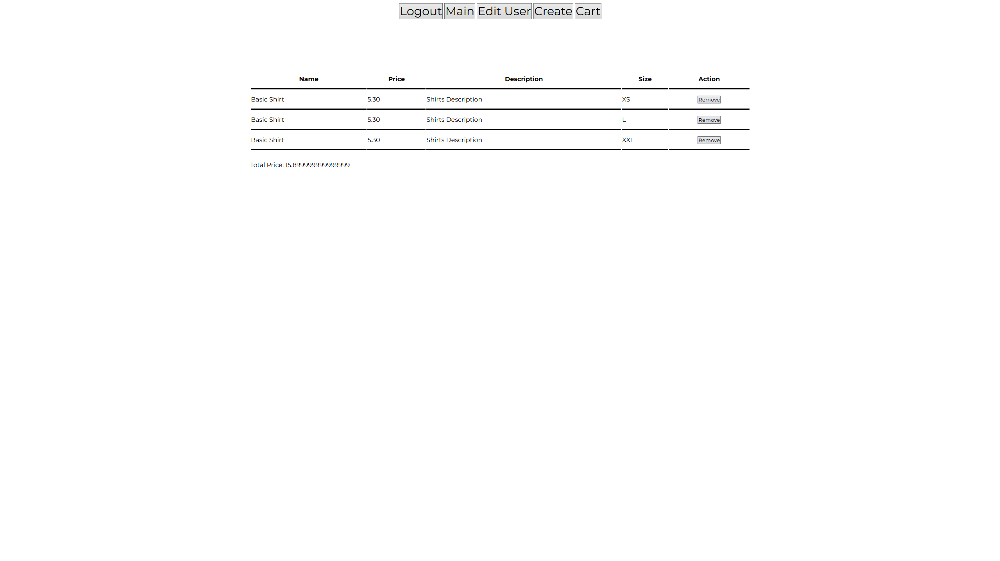

# 2023-9 Laravel Basic Login Project

## Overview  
This Laravel project serves as an introduction to CRUD by building the foundation of an e-commerce store, with a focus on user authentication and basic functionality.

## Features
- Easy to navigate page layout.
- Validation, that tells the user what field has an incorrect input and remembers the old input values.
- Login/Register functionality.
- CRUD for user and product table.
- Cart, that displays what items were added and calculates the total price.

## How to Run

Follow the steps below to set up and run this Laravel project using Visual Studio Code, XAMPP, and MySQL Workbench.

1. **Open the project folder** in Visual Studio Code.

2. **Launch XAMPP Control Panel**, then start **Apache** and **MySQL**.

3. **Open MySQL Workbench** and connect to your MySQL server.

4. **Run the following SQL script** to create the database and user:
   sql
   CREATE DATABASE your_database_name;
   USE your_database_name;
   CREATE USER 'your_username'@'localhost' IDENTIFIED BY 'your_password';
   GRANT ALL PRIVILEGES ON your_database_name.* TO 'your_username'@'localhost';
   FLUSH PRIVILEGES;

5. **Inside VS create a copy of .env.example and rename it to .env.** Then edit it like this:
    DB_CONNECTION=mysql
    DB_HOST=127.0.0.1
    DB_PORT=your_MySQL_port
    DB_DATABASE=your_database_name
    DB_USERNAME=your_username
    DB_PASSWORD=your_password

6. **Update your php.ini file** (run php --ini to find it), and make sure the following lines are uncommented (remove ;):
    extension=pdo_mysql
    extension=mysqli
    extension=fileinfo

7. **Run these scripts inside VS terminal in order:**
    composer install
    php artisan key:generate
    php artisan migrate
    php artisan serve

8. **Open your web browser** and visit the local development URL provided.
